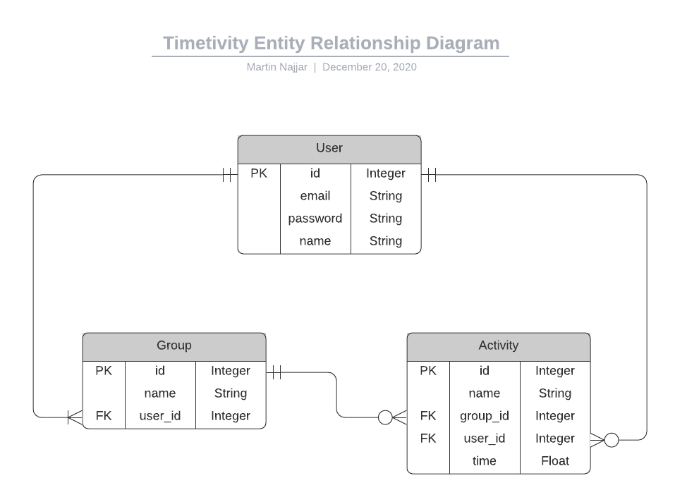
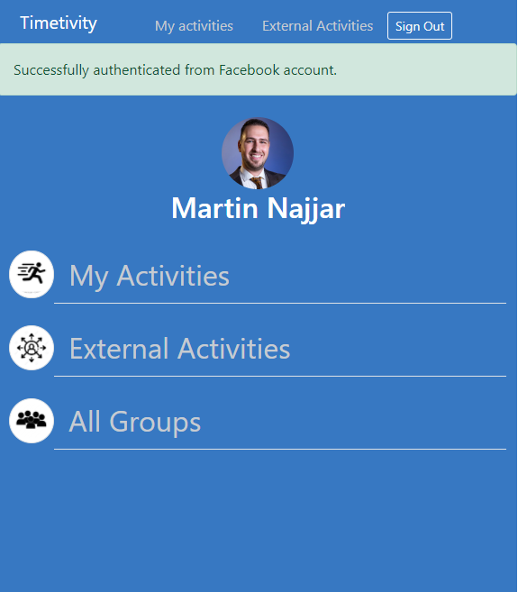

# Timetivity

> This app helps managing your time by showing you the actual time you spend on each activity.



<p align='center'><small>Database Diagram</small></p><br /><br />



<p align='center'><small>A user interface screenshot</small></p><br /><br />

## Built With

- Ruby v2.7.1
- Ruby on Rails v6.0.3.4
- Postgresql
- Tested via RSpec and Capybara

## Features

- User can sign in using his email, or via his Facebook account.
- User can choose his own profile picture, or use the picture that he uses with Gravatar.
- User can upload a specific picture to a specific group, or can ignore that and a default icon is shown.
- An External Activities group is gonna be initialized once User create his account.
- User can categorized his activities to his groups.
- User can see how much time he spent on each individual activity.
- User can see how much time he spent on each individual group.

## Live Demo

(https://timetivity.herokuapp.com/)

## Getting Started

To get a local copy up and running follow these simple example steps.

### Prerequisites

Ruby: 2.6.3
Rails: 5.2.3
Postgres: >=9.5

### Setup

Instal gems with:

```
bundle install
```

Install the required dependencies via:

```
yarn install --check-files
```

Or:

```
npm install
```

Setup database with:

```
   rails db:create
   rails db:migrate
```

### Usage

Start server with:

```
    rails server
```

Open `http://localhost:3000/` in your browser.

**Note:** Sign in via Facebook may not work on your local machine because you don't have the access to the APP_ID and APP_SECRET.

### Run tests

```
    rpsec --format documentation
```

## Martin Najjar

- Github: [@martinnajjar12](https://github.com/martinnajjar12)
- Twitter: [@martin_najjar](https://twitter.com/martin_najjar)
- LinkedIn: [Martin Najjar](https://www.linkedin.com/in/martinnajjar12/)

## 🤝 Contributing

Contributions, issues and feature requests are welcome!

Feel free to check the [issues page](https://github.com/martinnajjar12/Timetivity/issues).

## Show your support

Give a ⭐️ if you like this project!

## Acknowledgments

Microverse and [Gregoire Vella](https://www.behance.net/gregoirevella)

